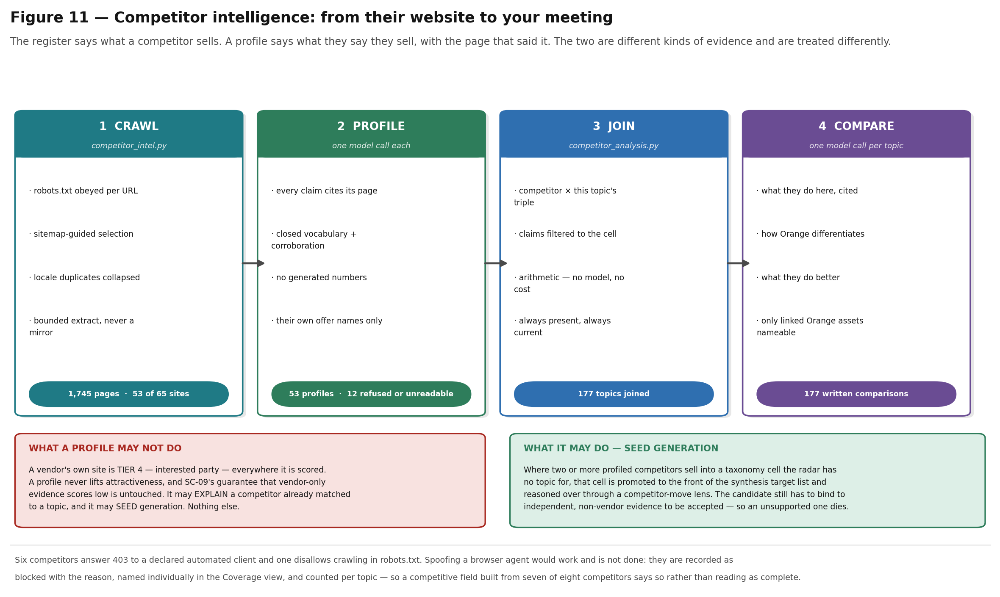

# Competitor intelligence

*How the radar learns what competitors are doing, what it is allowed to conclude
from that, and how it answers the question a salesperson actually has.*

---

## The gap this closes

`config/business_graph/competitors.yaml` is a curated register of 65 named
competitors with a type, aliases, verticals, technologies and a relationship to
Orange. `competition.py` matches that register against a topic and returns a
**level** — NONE / LOW / MEDIUM / HIGH — over a named list.

That is the right quantity, and it is not enough to walk into a meeting with. It
says nothing about **what those competitors are actually doing in this space**,
and nothing about **what Orange says when the customer names one of them**.

The register has a second weakness: it is a human's summary, written once, going
stale from the day it is written. This subsystem adds the other half — what each
competitor *says* it sells, taken from its own published pages, with the page
that said it attached to every claim.

---

## What a profile is allowed to do

This is the load-bearing constraint, and everything else follows from it.

A competitor's own website is **tier 4 — "interested party"** — under
`config/source_tiers.yaml`, exactly like a vendor press release. Weight 0.15,
contribution to evidence quality capped at 0.25, and there is a test (SC-09)
asserting that vendor-only evidence scores low.

So a profile may do exactly two things:

| It may | It may not |
|---|---|
| **Explain** a competitor that `competition.py` has already matched to a topic. | Lift attractiveness, or any other published score. |
| **Seed** generation — say where to look for a topic that does not exist yet. | Justify a topic on its own. |

A candidate produced by the competitor-move lens still has to bind to
independent, non-vendor evidence to survive, exactly like every other candidate.
If nothing corroborates it, it dies — which is the correct outcome, and is what
makes seeding here safe.

---

## The four stages



### 1 · Crawl — `competitor_intel.py`

Sitemap-guided, robots-aware, per-host paced.

* **robots.txt is obeyed per URL, not per host.** A path that is disallowed is
  not crawled even when the rest of the host is open. A host whose robots.txt
  cannot be *read* fails closed — the entry point only.
* **Sitemap first, homepage links as fallback.** URLs are partitioned as they
  arrive into those whose path names a solution, industry, product or customer
  story, and everything else. The second group only ever tops up, capped at a
  quarter of the budget — otherwise a documentation tree in alphabetical order
  fills the corpus, which is exactly what the first implementation did.
* **Locale duplicates collapse.** Every large vendor publishes the same page
  under a dozen locales and lists all of them in the sitemap. Forty pages of
  which thirty are translations of ten is a corpus that says a tenth of what it
  cost to fetch.
* **DR-08 applies unchanged.** A page is stored as its URL plus a bounded
  extract, never as a mirror.

### 2 · Profile — one model call per competitor

The input is marketing copy: the most self-serving text a company produces. That
is fine, because the question being asked of it is not *"is this true"* but
*"what does this company say it sells, and to whom"* — and for that question the
vendor is the primary source.

The same defences as synthesis apply, plus one:

1. **Evidence binding** — every claim carries the page ids that made it. Uncited
   claims are stripped, not rewritten.
2. **Closed vocabulary** — taxonomy values validated against the enumerations.
3. **No generated numbers** — not even one the vendor printed themselves.
   Marketing figures are unmethodical by construction.
4. **Corroboration** — *see below.* A valid vocabulary id still has to appear in
   the pages.

### 3 · Join — `competitor_analysis.py`

Arithmetic. For each competitor already matched to the topic, which of that
competitor's own claims touch this vertical, use case or technology, plus the
register overlap and the profiling status.

No model, no cost, always present, recomputed whenever the topic or a profile
moves. It is a keyword join, it is described as one, and that is precisely why
the *model* is asked to write the comparison rather than to decide what is
relevant.

### 4 · Compare — one model call per topic

Per competitor:

* **Activity** — what they are doing in this space, cited to their own pages. If
  their pages are silent, it says so rather than inferring.
* **Differentiation** — one paragraph on how Orange differentiates against *this
  competitor specifically*, for *this opportunity*.
* **Concession** — what that competitor genuinely does better. A paragraph that
  gives the competitor nothing reads as marketing and gets discounted whole.

Plus one paragraph on the shape of the field.

---

## The differentiation paragraph

This is the part a salesperson repeats verbatim in a meeting, so it carries a
guard beyond the usual four: **it may only name Orange assets that are LINKED to
this topic in the business graph.**

Where nothing is linked, the honest paragraph says Orange would be competing on
price and delivery rather than on a structural advantage. An invented advantage
is not caught in review — it is caught in the meeting.

What makes one usable:

* It **names the asymmetry**: sovereignty and EU data residency against a
  hyperscaler; an owned network and field operations against a systems
  integrator; integration breadth against a point specialist.
* It is **anchored** on a named offer, certification, partner tier or published
  reference — and the interface prints which.
* It **concedes what is true**.
* It says **what to lead with and what to avoid arguing about**.

Superlatives are rejected by the prompt: "better", "leading" and "best-in-class"
are not differentiators. A named capability the competitor demonstrably lacks is.

---

## Two defects worth knowing about

Both shipped in the first implementation and were caught before the feature was
used. Both are now regression tests in `tests/test_competitor_intel.py`.

### The model echoed the vocabulary list

Asked for OVHcloud's technologies, the model returned **the first eight ids of
the technology vocabulary in vocabulary order** — private 5G, O-RAN, network
slicing, SD-WAN, SASE, satellite NTN, LPWAN, Wi-Fi 6E. Every one is a real id, so
every one passed closed-vocabulary validation. OVHcloud's pages mention 5G
exactly zero times.

A list-echo is *the* characteristic failure of handing a model an enumeration and
asking it to pick from it, and the enumeration is exactly what makes it survive
validation. Those tags feed topic seeding, so this was load-bearing garbage.

**The fix** is the rule `enrichment` already applies to signal attachment —
*"similarity alone is not evidence"* — applied to the same problem in a different
place: a tag now needs a second, independent reason, namely that the term
actually appears in the pages the profile was built from.

Matching is on **word boundaries**, and nothing shorter than four characters
counts. `"Private 5G / LTE"` splits to `"lte"`, and substring-matching a
three-letter token corroborates almost anything — the same false positive
`competition.py` guards against with its alias matcher.

### A citation proved the page was read, not that it said this

Asked for Accenture's named offers, the model returned *"Accenture LED
Flashlight"* and *"Accenture PED Safety Bag"* — with page ids attached. Offer
names now have to appear in the corpus too.

---

## Coverage is reported, not assumed

Of 65 registered competitors, **53 are profiled**. The other 12 are each recorded
with a reason and named individually in the Coverage view:

| Status | Count | Meaning |
|---|---:|---|
| `blocked` | 6 | The site refuses automated clients (403), or robots.txt disallows crawling. |
| `no_pages` | 3 | Fetched successfully but renders content client-side, so nothing readable came back. |
| `unreachable` | 3 | TLS failure, timeout, or rate-limited past the circuit breaker. |

**On the six that refuse automated clients:** a browser User-Agent gets straight
through. That is not done. A 403 to a declared bot is a refusal, and the project
already handles refusals this way — `config/sources.yaml` records Ofcom as
unwired for exactly this reason. They are recorded as blocked with the reason,
shown in the interface as a profiling gap, and counted per topic, so a
competitive field built from seven of eight competitors says so rather than
reading as complete.

This is a decision with an owner rather than a technical limit. If Orange decides
the trade is worth making, it is a one-line change to the user agent — but it
should be a decision, not a default.

---

## Seeding generation

Where **two or more** profiled competitors sell into a taxonomy cell the radar
has no topic for, that cell is promoted to the front of the synthesis target
list and reasoned over through a fifth evidence lens:

> *Reason from COMPETITIVE MOVEMENT. Some of the target cells below are places
> where two or more named competitors already sell. Ask what customer problem
> that movement implies, then check whether THIS cluster's evidence
> independently supports it. If the evidence does not support it, do not propose
> it — a competitor's marketing is not a market.*

Two competitors, not one: a single vendor tagging a cell is that vendor's
marketing; two independently is a pattern worth a pass. The cross-product of one
profile's tags is large and mostly spurious — a competitor tagged with 6
verticals, 8 use cases and 6 technologies implies 288 cells, almost none of which
they actually sell — so requiring two and taking the top slice is what turns that
cross-product back into a signal.

### A bug this uncovered

The lens rotation was `GENERATION_LENSES[index % len(LENSES)]` where `index` runs
over `candidates_per_cluster` (3) and there were 4 lenses. **Lens 4 —
cross-vertical — never fired, for the entire life of the pipeline**, and the new
competitor lens would have been dead on arrival too.

The window is now offset per cluster, so each cluster still gets three
*different* lenses while the corpus as a whole gets all five.

---

## Where it appears

| Surface | What it shows |
|---|---|
| **Full-screen space → Competitors tab** | The join and, when generated, the comparison. Structural and written content are visually distinct throughout. |
| **PDF brief** | A dedicated section per competitor. Briefs built before it exists are flagged **incomplete** — distinct from stale — with a regenerate control. |
| **Coverage tab** | Three progress bars: register read, spaces assessed, comparisons written; plus the unread competitors named individually. |
| **`GET /api/competitors`** | The register with profiling status. |
| **`GET /api/competitors/{id}`** | One profile with the pages behind every claim. |

---

## Running it

```bash
radar competitor-scrape                      # crawl (robots-aware, ~15-20 min)
radar competitor-profile                     # one model call per competitor
radar competitor-analysis --no-llm           # the join, for every topic, free
radar competitor-analysis --limit 40         # write comparisons, capped
```

Options and troubleshooting are in [OPERATIONS.md](OPERATIONS.md). Configuration
lives under `competitor_intel:` in `config/settings.yaml`.
